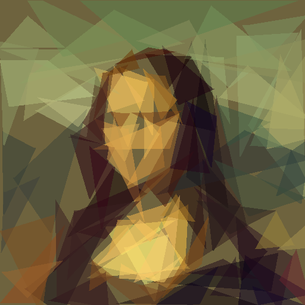

# Rusty Days Hackathon

> The topic is "Emergent phenomena"("Amaze us with simple rules").

Purr using some combination of primitives(triangles in this project), to fit pictures.

The rule is really simple, like hill climbing, we randomly genrate some triangles, then try to find the shortest path to the target image.

It's a rust implementation of fogleman's [primitive](https://github.com/fogleman/primitive)

## Feature

Simple rules

### Usage

> cargo build --release
> 
> ./target/release/purr -i ./assets/input.png -o ./output.png -n 100

args:

- `-i`: input image
- `-o`: output image
- `-n`: number of shapes
- `-t`: optional, number of threads, default to `num_cpus::get()`

## Example

using

> -i ./assets/input.png -o ./output.png -n 100

input image

output image

process

## TODO

- [ ] More primitives

## About Performance

This program is CPU intensive, it does all rendering in memory.

But it still runs very fast on release build, it even might be faster than fogleman's original implementation.

