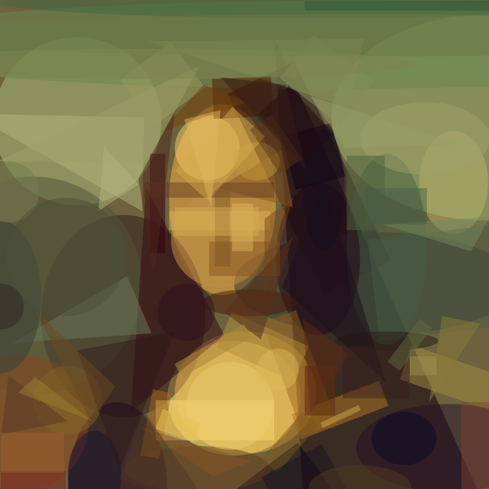
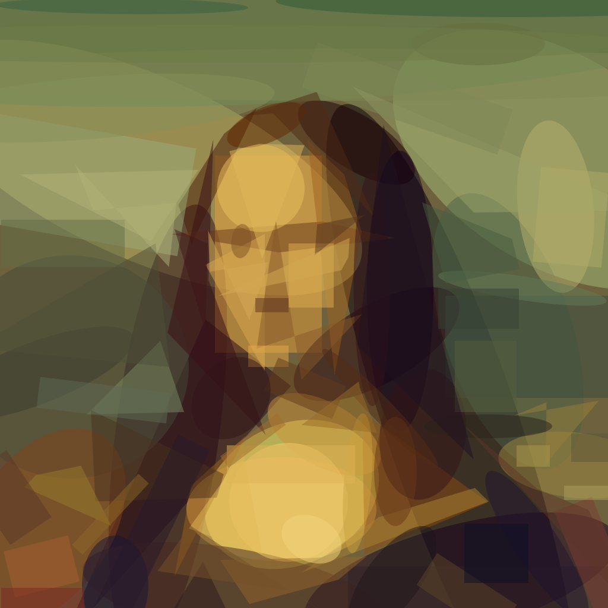
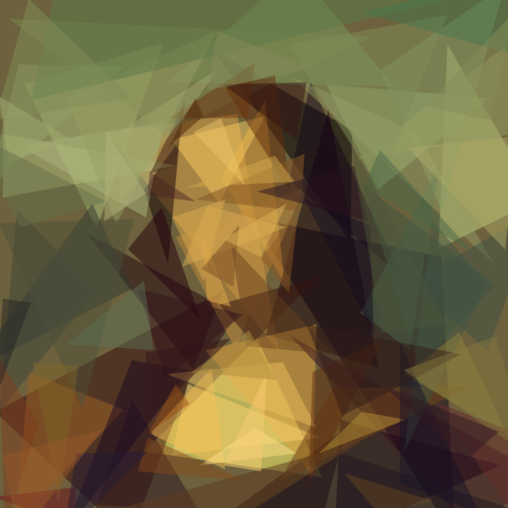
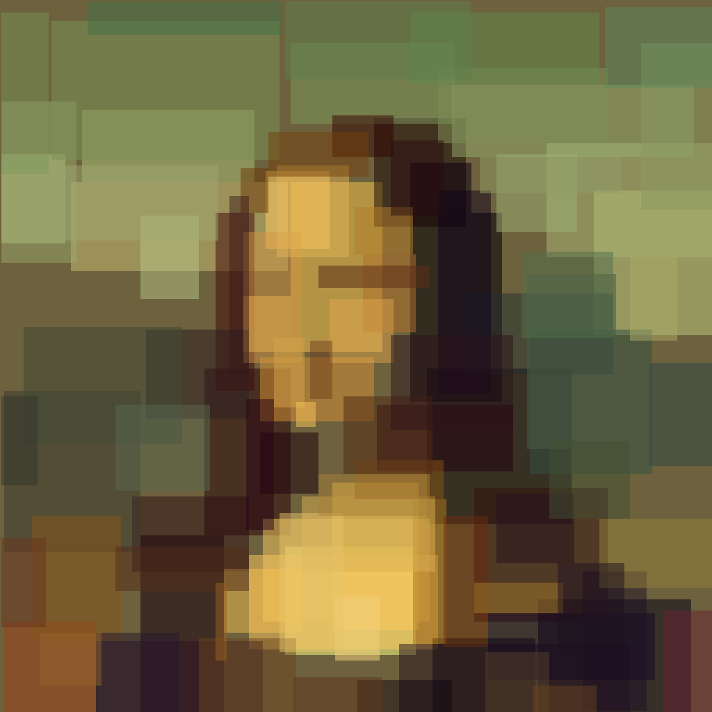
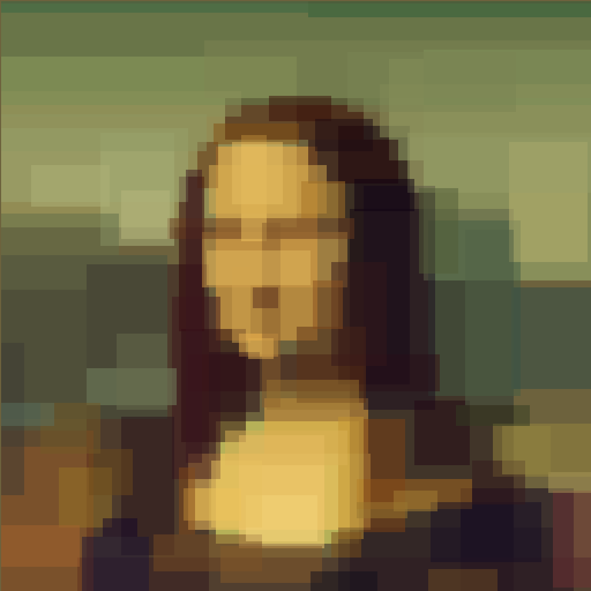
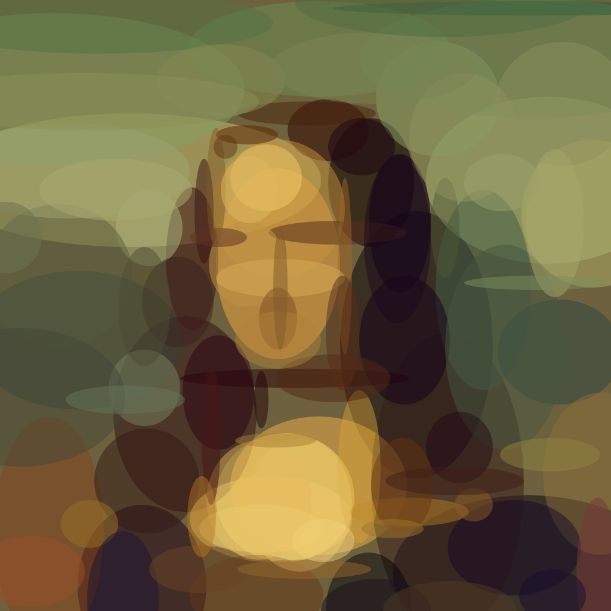
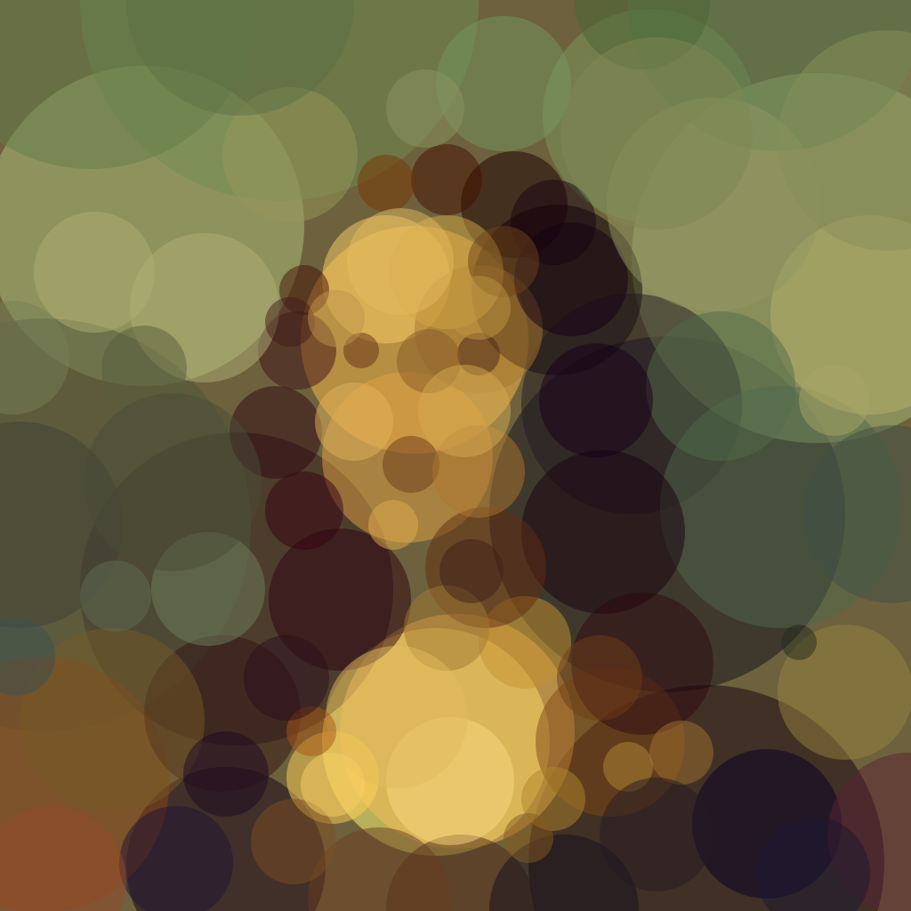
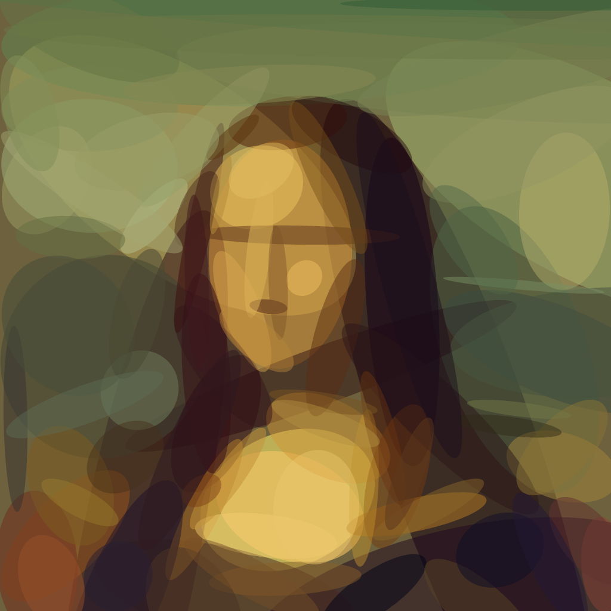

# Purr

It's a rust implementation of fogleman's [primitive](https://github.com/fogleman/primitive).

Created at Rusty Days Hackathon, 2020.

For more details about the algorithm, check this out: [Hill Climbing](https://en.wikipedia.org/wiki/Hill_climbing)

## Feature

Simple rule, powerful result

### Usage

Use `purrmitive` as lib

> purrmitive = "\*"

or install `purr` as binary

> cargo install --bin purr --features="cli" purrmitive

or

> cargo run --release --features=cli --bin=purr  --  -i ./assets/input.png -o output.gif -n 100

most `primitive` flags are supported, it should be a dropin replacement in most cases.

```
USAGE:
    purr [FLAGS] [OPTIONS] -i <input> -n <number> -o <output>

FLAGS:
    -h, --help       Prints help information
    -v               the level of verbosity, v/vv/vvv
    -V, --version    Prints version information

OPTIONS:
    -a <alpha>             alpha value
    -b <background>        starting background color (hex)
    -i <input>             input image
    -m <mode>              mode: 0=combo 1=triangle 2=rect 3=ellipse 4=circle 5=rotatedrect 6=beziers 7=rotatedellipse
                           8=polygon(default 1)
    -n <number>            number of shapes
    -o <output>            output image
    -r <resize>            input size
    -s <size>              output size
    -j <thread>            numebr of threads
```

Output Formats:

png, jpg, svg and gif are all supported. You can also include `{}` in output file name, for example, `-o "/tmp/out/out{}.png"` will save every frame in that directory as `/tmp/out/outX.png` X in range of [1, n]


## Example

using

> -i ./assets/input.png -o output.gif -n 150

| primitive | input image | output image | process |
| --- | --- | --- | --- |
| triangle |  |  |  |
| ellipse |  |  |  |

try it yourself for more.


## Differences

### Output Difference

All the graphs supported by primitive are implemented, and the output of all graphs (except the bezier curves) is basically the same.

The original primitive version of bezier curves supports line thickness adjustment, which is not possible in purr. But the result is still not bad.

### Usage Difference

The key options and parameters of purr are the same as primitive, and in most cases you can just replace primitive with purr.

The rest of the parameters not listed above have not been implemented yet(these parameters will be supported in the future)

### Performance Difference

All types of graphical fits are faster than primitive on my computer. See the next section for more specific data. 

One possible factor is that in my implementation, the "next-step" buffer is skiped, by modified the diff function. It costs less comapring to copy the current buffer, update it then read it.

## About Performance

This program is CPU intensive, it does all rendering in memory.

Purr is faster than the original implementation.

Benchmark using `-n 100 -m {0-8}`, see the results below.

> hyperfine --parameter-scan m 0 8 -D 1 './target/release/purr -i ./assets/input.png -o assets/purr.{m}.png -n 100 -m {m}' '~/go/bin/primitive -i ./assets/input.png -o assets/primitive.{m}.png -n 100 -m {m}' --export-json benchmark.json


| Command | Mode | Mean [s] | Min [s] | Max [s] | result |
|:---|---|---:|---:|---:|---:|
|purr|combo| 10.256 ± 0.385|9.202|10.467| |
|primitive|combo| 15.068 ± 0.213|14.785|15.405| |
|purr|triangle| 6.927 ± 0.201|6.510|7.136| |
|primitive|triangle| 10.577 ± 0.266|10.109|10.879| |
|purr|rect| 6.224 ± 0.087|6.132|6.380| |
|primitive|rect| 7.505 ± 0.105|7.388|7.765| |
|purr|ellipse| 12.516 ± 0.098|12.354|12.674| |
|primitive|ellipse| 14.643 ± 0.279|14.189|15.193| |
|purr|circle| 15.054 ± 0.236|14.739|15.452| |
|primitive|circle| 17.375 ± 0.187|17.156|17.760| |
|purr|rotatedrect| 8.045 ± 0.081|7.938|8.220| |
|primitive|rotatedrect| 9.181 ± 0.154|8.922|9.496| |
|purr|beziers| 3.050 ± 0.127|2.815|3.223| |
|primitive|beziers| 11.951 ± 0.173|11.563|12.114| |
|purr|rotatedellipse| 12.282 ± 0.166|11.942|12.496| |
|primitive|rotatedellipse| 27.795 ± 0.401|27.273|28.694| |
|purr|polygon| 8.355 ± 0.219|7.988|8.748| |
|primitive|polygon| 15.995 ± 0.275|15.426|16.431| |

